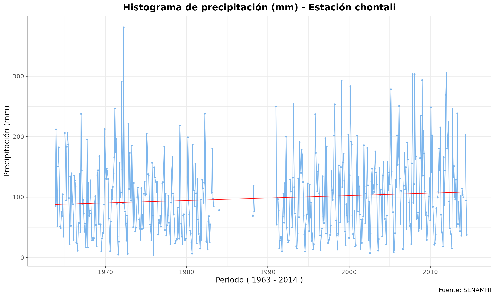

# SENAMHI Data Analysis Program

This program retrieves data from the SENAMHI (Peruvian National Meteorology and Hydrology Service) stored in the "data" folder and converts it into histograms, exporting the images to the "histograms" folder.

## Requirements
- dplyr
- tidyr
- ggplot2

## Usage

1. Make sure you have R installed on your system.
2. Clone or download this repository to your local machine.
3. Place your SENAMHI data files in the "data" folder.
4. Install the required R libraries by running the following commands:

```R
install.packages("dplyr")
install.packages("tidyr")
install.packages("ggplot2")
```

Run the main.R script to import and analyze the data:

## Description

### Importing Data
- The script imports data from the "data" folder using the getDataFolder() function from Import Data.R.
- It also assigns names to the datasets using the setNames() function.

### Visual Graphical Analysis
- The data is transformed by month using the ordTableMonth() function from Graphics.R.
- Histograms are generated for each dataset using the getGraphMonth() function.
- Plots are exported as images to the "histograms" folder using the exportPlots() function.

## Example Result

This image is an example histogram generated by the program.


